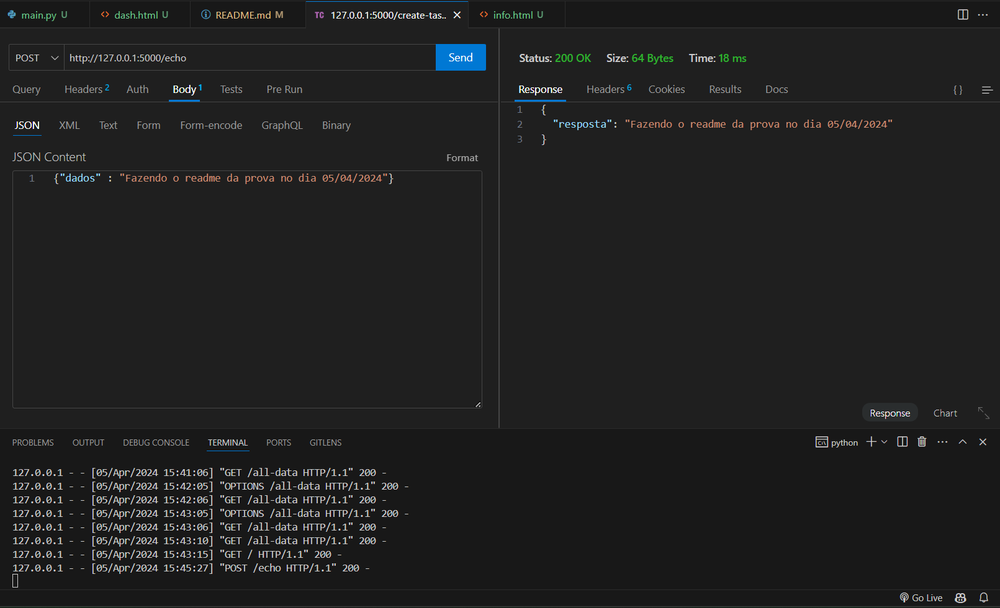
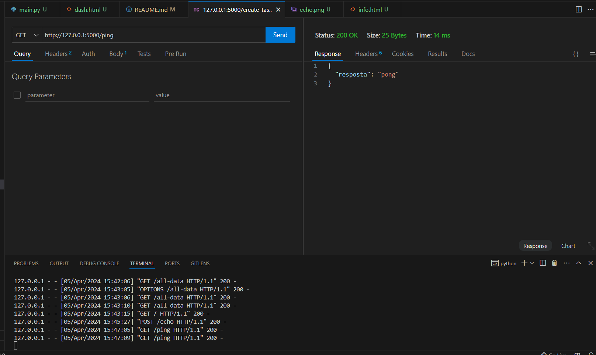
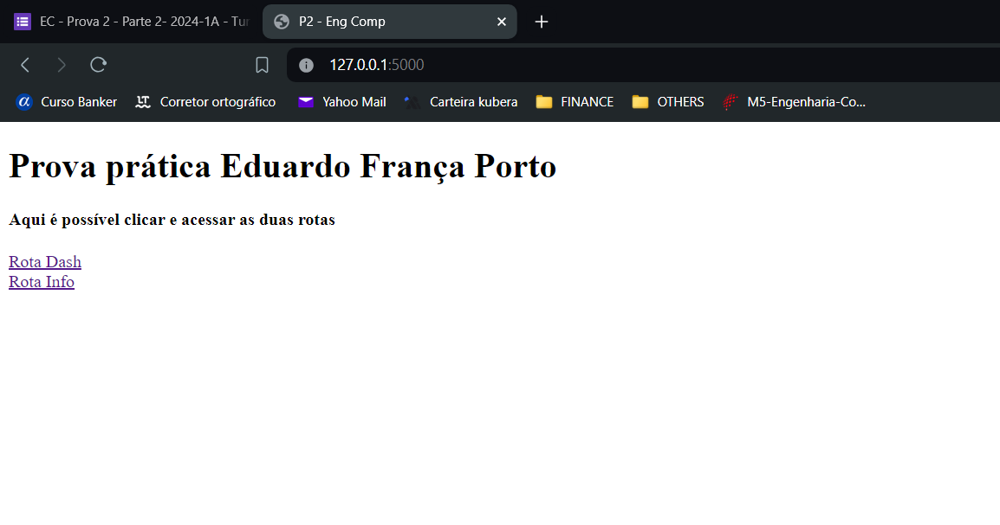
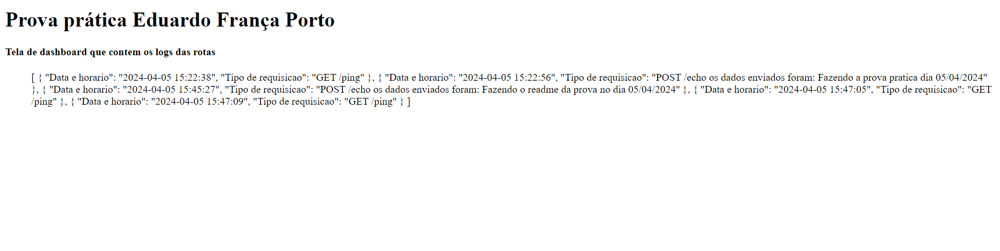
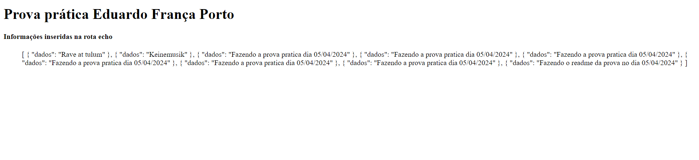

# prova2-m5
 Prova prática do curso de engenharia da computação. 

 **Aluno** Eduardo França Porto 

## Objetivo

O objetivo desta atividade é montar uma interface web com Flask e HTMX. Nessa interface é possível conferir os logs da API e os dados que foram inseridos na API. 

## Como utilizar 
Para executar o projeto na sua máquina execute os seguintes passos no terminal.

1º Criar um ambiente virtual na pasta backend

<code>python -m venv venv </code>

2º Ativar o ambiente virtual 
 
<code> cd venv </code>

<code> cd Scripts </code>

<code> activate </code>

3º Instalar as dependências 

<code> pip install -r requirements.txt </code>

4º Rodar o projeto  
<code> python main.py</code>

Após rodar o projeto basta acessar a página  **http://127.0.0.1:5000/** que é possível utilizar a solução. 

## Atividades desenvolvidas  

### API ECHO 
Essa api guarda as informações que foram digitadas pelo usuário em um banco de dados TinyDb.

   

### API PING 
Essa api retorna um json "pong".

   

### FRONTEND HOME 
Essa é a tela que você acessa após rodar o código e acessar **http://127.0.0.1:5000/**
   

### FRONTEND DASH 
Aqui é possível conferir todos os logs de acesso que a API teve 
   

### FRONTEND INFO 
Nesta tela é possível conferir todas as informações inseridas na api echo e salvas no arquivo db.json
   

